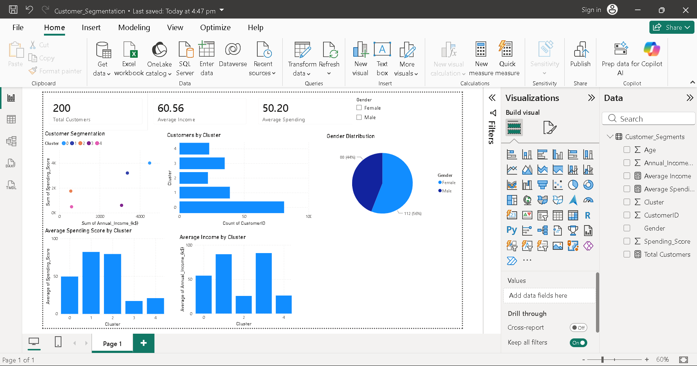
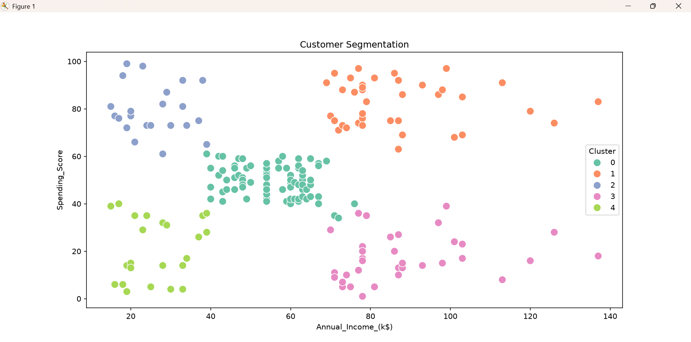
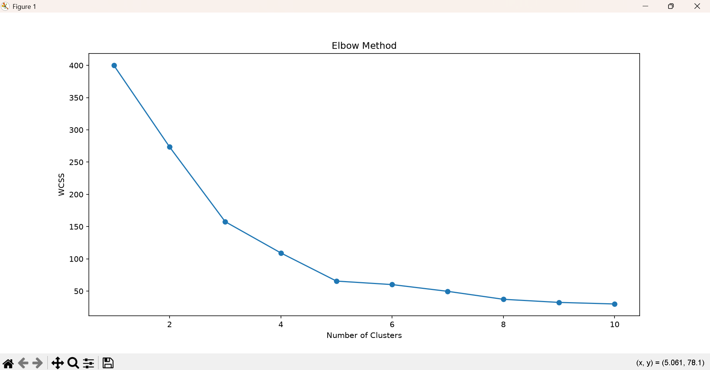

# Customer-Segmentation-Project

# Customer Segmentation Using K-Means Clustering


A Data Analytics project that segments mall customers into meaningful groups using the **K-Means Clustering** algorithm. The project includes **Exploratory Data Analysis (EDA)**, **Machine Learning**, and an **interactive Power BI dashboard** to provide business insights for customer targeting and marketing strategies.

---

## Table of Contents

* [Project Overview](#project-overview)
* [Objectives](#objectives)
* [Dataset Information](#dataset-information)
* [Project Workflow](#project-workflow)
* [Technologies Used](#technologies-used)
* [Project Structure](#project-structure)
* [Results](#results)
* [Power BI Dashboard](#power-bi-dashboard)
* [Screenshots](#screenshots)
* [Business Insights](#business-insights)
* [How to Run the Project](#how-to-run-the-project)
* [Future Improvements](#future-improvements)
* [Author](#author)

---

## Project Overview

Customer segmentation helps businesses identify groups of customers with similar characteristics, allowing them to create personalized marketing campaigns and improve customer satisfaction.

This project analyzes customer demographic and spending data from the **Mall Customers Dataset**. The K-Means clustering algorithm is used to identify customer segments based on **Annual Income** and **Spending Score**. The findings are visualized using Python and Power BI.

---

## Objectives

* Perform customer segmentation using K-Means Clustering.
* Analyze customer demographics and spending behavior.
* Visualize customer patterns using Python.
* Build an interactive Power BI dashboard.
* Generate business recommendations based on customer segments.

---

## Dataset Information

**Dataset:** Mall Customers Dataset

| Feature            | Description                           |
| ------------------ | ------------------------------------- |
| CustomerID         | Unique customer identifier            |
| Gender             | Male/Female                           |
| Age                | Customer age                          |
| Annual_Income_(k$) | Annual income in thousands of dollars |
| Spending_Score    | Customer spending score               |

**Dataset Size**

* Records: **200**
* Features: **5**

---

## Project Workflow

1. Data Collection
2. Data Preprocessing
3. Exploratory Data Analysis (EDA)
4. Feature Selection
5. Feature Scaling
6. Elbow Method
7. K-Means Clustering
8. Cluster Visualization
9. Power BI Dashboard
10. Business Insights

---

## Technologies Used

* Python
* Pandas
* NumPy
* Matplotlib
* Seaborn
* Scikit-learn
* Power BI
* Git & GitHub

---

## Project Structure

```text
Customer-Segmentation-Project/
│
├── Data/
│   └── Mall_Customers.csv
│
├── Notebook/
│   └── customer_segmentation.py
│
├── Dashboard/
│   └── Customer_Segmentation.pbix
│
├── Report/
│   ├── Customer_Segmentation_Report.docx
│   └── Customer_Segmentation_Report.pdf
│
├── Screenshots/
│   ├── Age_Distribution.png
│   ├── Gender_Distribution.png
│   ├── Income_Distribution.png
│   ├── Spending_Distribution.png
│   ├── Income_vs_Spending.png
│   ├── Elbow_Method.png
│   ├── Cluster_Plot.png
│   └── Dashboard.png
│
├── Customer_Segments.csv
├── requirements.txt
└── README.md
```

---

## Results

The K-Means algorithm identified **five customer segments** based on annual income and spending score.

The segmentation revealed customer groups with different purchasing behaviors, helping businesses identify:

* High-value customers
* Budget-conscious customers
* Premium shoppers
* Potential growth segments

---

## Power BI Dashboard

The dashboard includes:

* KPI Cards
* Customer Segmentation Scatter Plot
* Customers by Cluster
* Gender Distribution
* Average Income by Cluster
* Average Spending Score by Cluster
* Gender Filter (Slicer)

---

## Screenshots

### Dashboard

### Cluster Visualization




### Elbow Method



---
## Business Insights

* High-income, high-spending customers represent the most valuable segment.
* High-income, low-spending customers may respond well to targeted promotions.
* Moderate-income customers can be engaged through loyalty programs.
* Customer segmentation enables data-driven marketing and improves decision-making.

---

## How to Run the Project

Clone the repository:

```bash
git clone https://github.com/riddhiasb-09/Customer-Segmentation-Project.git
```

Open the project folder:

```bash
cd Customer-Segmentation-Project
```

Install the required libraries:

```bash
pip install -r requirements.txt
```

Run the Python script:

```bash
python Notebook/customer_segmentation.py
```

Open the Power BI dashboard:

```text
Dashboard/Customer_Segmentation.pbix
```

---

## Future Improvements

* Compare multiple clustering algorithms.
* Use larger customer datasets.
* Deploy the dashboard online.
* Add customer lifetime value analysis.
* Build a predictive recommendation system.

---

## Author

**Riddhi Singh**

Data Analytics Enthusiast

GitHub: [github.com/riddhiasb-09](https://github.com/riddhiasb-09)

LinkedIn: [www.linkedin.com/in/riddhi-bhati-917916309](https://www.linkedin.com/in/riddhi-bhati-917916309/)

Customer Segmentation using K-Means Clustering and Power BI for customer analytics.
